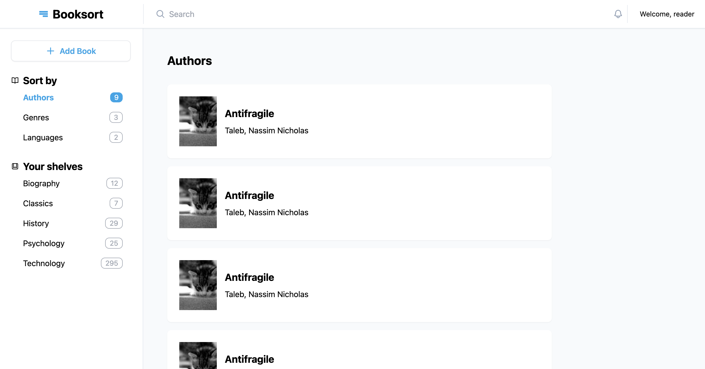

# Booksort

**An app for sorting small personal libraries**

I have too many books.

This makes it hard to organize them on my shelves, but also means I don't have a large enough collection to warrant the kind of software a real library would use.

Enter Booksort.

It's a basic app that (once finished) will let me keep my books sorted. This is the frontend, which will connect to the [Booksort backend](https://github.com/stephengroe/booksort-backend) via API. It will incorporate the same logic as my version-zero prototype, [tinylib](https://github.com/stephengroe/tinylib).

- **Live demo:** [Netlify](https://curious-cuchufli-195a99.netlify.app/authors/all)
- **Built with:** React, TypeScript, TailwindCSS
- **License:** MIT

## Features

Really quite few at this point. The layout is structured, but the logic is still a work in progress. I'll be importing that logic from the previous iteration of this project, [tinylib](https://github.com/stephengroe/tinylib), which includes:

* **Add a book by ISBN.** Enter an ISBN and the app will auto-fill book data pulled from the [OpenLibrary API](https://openlibrary.org/developers/api).
* **ISBN validation.** The app validates ISBNs on the client side before sending an API request. It does this by analyzing requirements for 10- and 13-digit numbers, like valid characters and check digits, according to [the ISBN specification](https://en.wikipedia.org/wiki/ISBN#Check_digits).
* **Manually add a book.** It's a lot faster to automatically add a book, but no database is perfect. You can manually add any title that's not in the OpenLibrary database.

## Improvements

- [ ] **Add backend integration.** All data is currently just dummy data! I'll integrate it with a backend built in Node.js.
- [ ] **Make design responsive.** Currently only works on desktop/large tablet display sizes.
- [ ] **Add Sorting.** The whole point I started this project! I'll be pulling in a variety of additional data from OpenLibrary, including Dewey Decimal Classification numbers, fiction/non-fiction, and general topic. I'll add nested sorting options for custom sort (e.g., fiction by author last name; non-fiction by DDC to two digits then by title).
- [ ] **User authentication.** Users should be able to create an account and store their own personal library.
- [ ] **Edit page.** Each book has an "edit" button, but it doesn't lead anywhere. I need to add a frontend interface for the existing update functions.

## Acknowledgements

* All icons are from [Heroicons](https://heroicons.com) (MIT license)